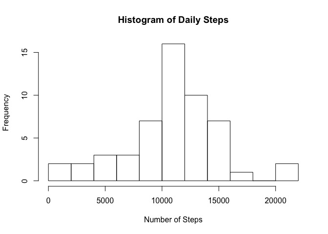
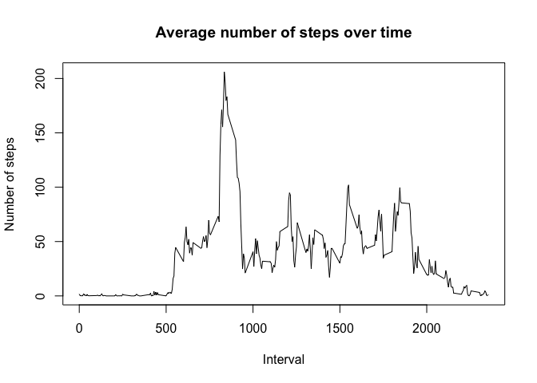
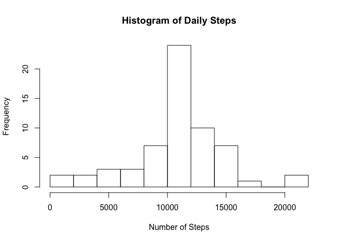
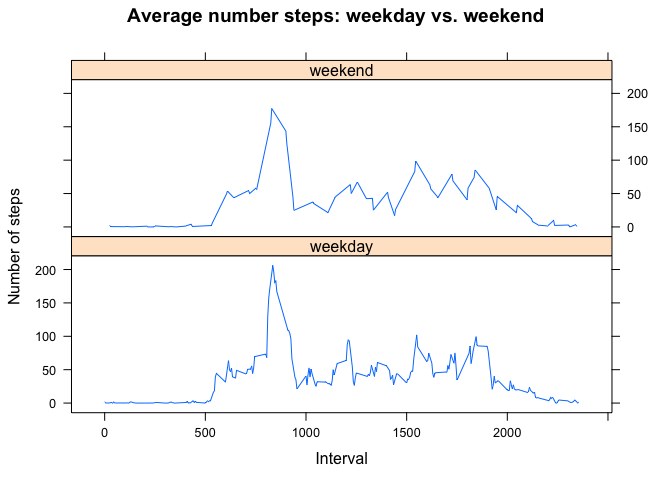

## Loading and preprocessing the data


```r
dat <- read.csv("activity.csv")
dat$date <- as.Date(dat$date, "%Y-%m-%d")
```


## What is mean total number of steps taken per day?
**Calculate the total number of steps taken per day:**

```r
daily_steps <- tapply(dat$steps, dat$date, sum)
```

**Calculate and report the mean and median of the total number of steps taken per day:**  
Mean number of daily steps:

```r
mean(daily_steps,na.rm = TRUE)
```

```
## [1] 10766.19
```

Median number of daily steps:

```r
median(daily_steps,na.rm = TRUE)
```

```
## [1] 10765
```

**Make a histogram of the total number of steps taken each day:**

```r
hist(daily_steps,xlab = 'Number of Steps', main = 'Histogram of Daily Steps', breaks=15)
```

<!-- -->

## What is the average daily activity pattern?
**Make a time series plot of the 5-minute interval and the average number of steps taken, averaged across all days:**

```r
average_steps <- tapply(dat$steps, dat$interval, mean, na.rm=T)
intervals <- dat$interval[1:288]
plot(intervals, average_steps, type='l', ylab = 'Number of steps', 
     xlab='Interval', main = 'Average number of steps over time')
```

<!-- -->

**Calculate the 5-minute interval that contains the maximum number of steps on average:**

```r
intervals <- dat$interval[1:288]
max <- which.max(average_steps)
intervals[max]
```

```
## [1] 835
```

## Imputing missing values
**Calculate and report the total number of missing values in the dataset:**

```r
sum(is.na(dat$steps))
```

```
## [1] 2304
```

**Fill in all of the missing values in the dataset:**  
Impute with the mean for that missing value's 5-minute interval:

```r
library(plyr)
impute.mean <- function(x) replace(x, is.na(x), mean(x, na.rm = TRUE))
dat2 <- ddply(dat, ~ interval, transform, steps = impute.mean(steps))
```

**Make a histogram of the total number of steps taken each day with imputed data: **

```r
daily_steps2 <- tapply(dat2$steps, dat2$date, sum)
hist(daily_steps2,xlab = 'Number of Steps', main = 'Histogram of Daily Steps', breaks=15)
```

<!-- -->

**Calculate and report the mean and median total number of steps taken per day:**

```r
mean(daily_steps2)
```

```
## [1] 10766.19
```

```r
median(daily_steps2)
```

```
## [1] 10766.19
```

These values do not differ very much from the values calculated before filling in the missing values. The mean is exactly the same, and the median is only one step greater.

## Are there differences in activity patterns between weekdays and weekends?
**Create a new factor variable in the dataset indicating whether a given date is a weekday or weekend day:**

```r
dat2$weekday <- weekdays(dat2$date)
dat2$weekday <- as.factor(ifelse(dat2$weekday %in% c('Sunday','Saturday'),'weekend','weekday'))
```

**Make a panel plot containing a time series plot of the 5-minute interval and the average number of steps taken, averaged across all weekday days or weekend days:**

```r
library(lattice)
average_steps <- tapply(dat2$steps, dat2$interval, mean)
xyplot(average_steps ~ intervals | weekday, data = dat2, type = "l",
            main="Average number steps: weekday vs. weekend",
            xlab="Interval",
            ylab = 'Number of steps',
            layout=c(1,2))
```

<!-- -->

The activity patterns of weekdays and weekends have the same general shape.  
    
          


